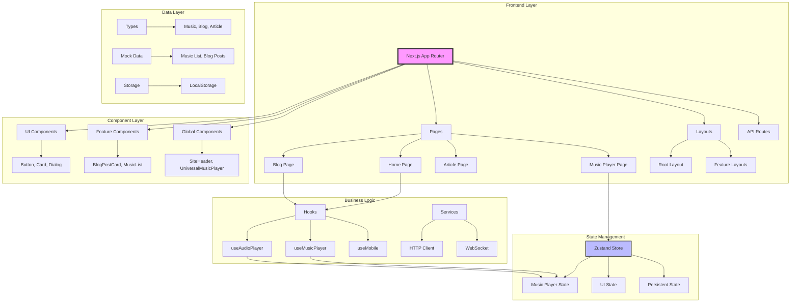

# 朝阳码农札记 - 博客网站架构分析

## 项目概述

这是一个基于 Next.js 15.3.2 的全栈博客网站，采用现代化的技术栈和架构设计，支持文章发布、音乐播放、相册展示、聊天室等多种功能模块。

## 技术栈分析

### 核心技术框架
- **前端框架**: Next.js 15.3.2 (React 19.0.0)
- **编程语言**: TypeScript 5.x
- **样式方案**: Tailwind CSS 4.1.13 + PostCSS
- **状态管理**: Zustand 5.0.8
- **UI组件库**: Radix UI + 自定义组件

### 构建与部署
- **构建工具**: Next.js Turbopack
- **包管理**: pnpm
- **部署方式**: Standalone 模式，支持 Docker 容器化
- **性能分析**: Bundle Analyzer 集成

### 第三方服务集成
- **评论系统**: Giscus (GitHub Discussions)
- **网站分析**: Umami (自托管分析平台)
- **内容分发**: 多域名图片资源支持

## 架构模式分析

### 1. 应用架构模式
```
┌─────────────────────────────────────────────────────────────┐
│                    Next.js App Router                       │
├─────────────────────────────────────────────────────────────┤
│  ┌─────────────┐  ┌─────────────┐  ┌─────────────┐       │
│  │   Layouts   │  │    Pages    │  │     API     │       │
│  │  (布局层)   │  │   (页面层)  │  │  (接口层)   │       │
│  └─────────────┘  └─────────────┘  └─────────────┘       │
├─────────────────────────────────────────────────────────────┤
│                    Components Layer                         │
│  ┌─────────────┐  ┌─────────────┐  ┌─────────────┐       │
│  │     UI      │  │   Feature     │  │   Shared    │       │
│  │  (基础组件) │  │  (功能组件)   │  │  (共享组件)  │       │
│  └─────────────┘  └─────────────┘  └─────────────┘       │
├─────────────────────────────────────────────────────────────┤
│                    Business Logic Layer                     │
│  ┌─────────────┐  ┌─────────────┐  ┌─────────────┐       │
│  │    Hooks    │  │   Services  │  │    Utils    │       │
│  │  (业务钩子) │  │  (服务层)   │  │  (工具函数) │       │
│  └─────────────┘  └─────────────┘  └─────────────┘       │
├─────────────────────────────────────────────────────────────┤
│                    Data Layer                              │
│  ┌─────────────┐  ┌─────────────┐  ┌─────────────┐       │
│  │    Types    │  │     Mock    │  │   Storage   │       │
│  │  (类型定义) │  │  (模拟数据) │  │  (本地存储) │       │
│  └─────────────┘  └─────────────┘  └─────────────┘       │
└─────────────────────────────────────────────────────────────┘
```

### 2. 组件架构模式

#### 组件分层设计
```
┌─────────────────────────────────────────────────────────────┐
│                  Global Components                          │
│  ┌─────────────────┐  ┌─────────────────┐                 │
│  │  SiteHeader     │  │  SiteFooter     │                 │
│  │  (网站头部)     │  │  (网站底部)     │                 │
│  └─────────────────┘  └─────────────────┘                 │
│  ┌─────────────────┐  ┌─────────────────┐                 │
│  │UniversalMusic   │  │GlobalAudio      │                 │
│  │Player (音乐播放器)│  │Player (音频播放器)│               │
│  └─────────────────┘  └─────────────────┘                 │
├─────────────────────────────────────────────────────────────┤
│                   Page-Level Components                       │
│  ┌─────────────────┐  ┌─────────────────┐                 │
│  │  HomePage       │  │  BlogPage       │                 │
│  │  (首页组件)     │  │  (博客页面)     │                 │
│  └─────────────────┘  └─────────────────┘                 │
│  ┌─────────────────┐  ┌─────────────────┐                 │
│  │  ArticlePage    │  │  AlbumPage       │                 │
│  │  (文章页面)     │  │  (相册页面)     │                 │
│  └─────────────────┘  └─────────────────┘                 │
├─────────────────────────────────────────────────────────────┤
│                  Feature Components                         │
│  ┌─────────────────┐  ┌─────────────────┐                 │
│  │  BlogPostCard   │  │  ProfileCard    │                 │
│  │  (博客卡片)     │  │  (个人资料卡)   │                 │
│  └─────────────────┘  └─────────────────┘                 │
│  ┌─────────────────┐  ┌─────────────────┐                 │
│  │  MusicList      │  │  Comment        │                 │
│  │  (音乐列表)     │  │  (评论组件)     │                 │
│  └─────────────────┘  └─────────────────┘                 │
├─────────────────────────────────────────────────────────────┤
│                    UI Components                            │
│  ┌─────────────────┐  ┌─────────────────┐                 │
│  │  Button         │  │  Card           │                 │
│  │  (按钮组件)     │  │  (卡片组件)     │                 │
│  └─────────────────┘  └─────────────────┘                 │
│  ┌─────────────────┐  ┌─────────────────┐                 │
│  │  Dialog         │  │  Progress       │                 │
│  │  (对话框)       │  │  (进度条)       │                 │
│  └─────────────────┘  └─────────────────┘                 │
└─────────────────────────────────────────────────────────────┘
```

### 3. 状态管理架构

#### Zustand 状态管理
```
┌─────────────────────────────────────────────────────────────┐
│                  Music Player Store                         │
├─────────────────────────────────────────────────────────────┤
│  State:                                                     │
│  - isPlaying: boolean                                       │
│  - currentMusic: IMusic | null                              │
│  - currentTime: number                                      │
│  - volume: number                                           │
│  - playlist: IMusic[]                                       │
├─────────────────────────────────────────────────────────────┤
│  Actions:                                                   │
│  - play(music: IMusic)                                      │
│  - pause()                                                  │
│  - resume()                                                 │
│  - stop()                                                   │
│  - setCurrentTime(time: number)                            │
│  - setVolume(volume: number)                               │
│  - next()                                                   │
│  - previous()                                               │
├─────────────────────────────────────────────────────────────┤
│  Persistence:                                               │
│  - LocalStorage 持久化                                      │
│  - 部分状态保存 (volume, currentMusic, currentTime)       │
└─────────────────────────────────────────────────────────────┘
```

### 4. 路由架构

#### Next.js App Router 结构
```
src/app/
├── layout.tsx              # 根布局
├── page.tsx                # 首页
├── about/page.tsx          # 关于页面
├── blog/[id]/page.tsx      # 博客列表页面
├── article/[uuid]/page.tsx # 文章详情页面
├── album/page.tsx          # 相册页面
├── chat/[roomId]/page.tsx  # 聊天室页面
├── libraries/[id]/page.tsx # 资源库页面
├── music-player/page.tsx   # 音乐播放器页面
├── tag/[id]/page.tsx       # 标签页面
├── timeline/page.tsx       # 时间线页面
└── api/rss/route.ts        # RSS API 路由
```

## 核心功能模块分析

### 1. 博客系统
- **文章管理**: 支持文章列表、详情展示、分页
- **标签系统**: 标签云展示、标签筛选
- **评论系统**: Giscus 集成，基于 GitHub Discussions
- **RSS 订阅**: 自动生成 RSS 源

### 2. 音乐播放器系统
- **核心功能**: 播放/暂停、上一首/下一首、音量控制
- **界面设计**: Material Design 风格，圆形播放按钮
- **响应式**: 移动端底部弹出，桌面端右侧悬浮
- **状态管理**: Zustand 状态持久化
- **音频控制**: 独立音频 Hook，支持播放进度管理

### 3. 相册系统
- **图片展示**: 网格布局，支持分类浏览
- **响应式设计**: 自适应不同屏幕尺寸

### 4. 聊天室系统
- **实时通信**: WebSocket 实现
- **房间管理**: 支持多房间聊天
- **消息展示**: 实时消息列表和输入框

### 5. 资源库系统
- **资源分类**: 支持多种资源类型
- **搜索筛选**: 关键词搜索和分类筛选

## 性能优化策略

### 1. 构建优化
- **Bundle 分析**: 集成 @next/bundle-analyzer
- **独立构建**: Standalone 模式，减少部署体积
- **图片优化**: 支持多域名图片资源，unoptimized 配置

### 2. 运行时优化
- **FPS 监控**: FPSCounter 组件实时监控
- **版本管理**: 自动版本号生成和显示
- **错误处理**: 完善的错误边界和 404 处理

### 3. 开发体验优化
- **TypeScript**: 严格的类型检查
- **ESLint**: 代码质量检查
- **热重载**: Turbopack 快速开发体验

## 设计模式应用

### 1. 组件模式
- **复合组件模式**: UniversalMusicPlayer 组合多个子组件
- **容器组件模式**: 页面组件负责数据获取，子组件负责展示
- **高阶组件模式**: 通过 Hooks 实现逻辑复用

### 2. 状态管理模式
- **集中式状态管理**: Zustand 统一状态管理
- **本地状态分离**: 组件内部状态与全局状态分离
- **持久化策略**: 选择性状态持久化

### 3. 数据获取模式
- **服务端获取**: Next.js 服务端数据获取
- **客户端请求**: Ky HTTP 客户端封装
- **模拟数据**: 完善的 Mock 数据体系

## 改进建议

### 1. 架构优化
- **微前端架构**: 考虑将音乐播放器等功能拆分为独立微应用
- **服务端渲染优化**: 进一步优化 SSR 性能
- **缓存策略**: 实现更完善的缓存机制

### 2. 功能扩展
- **用户系统**: 添加用户登录、个人中心
- **搜索功能**: 实现全文搜索功能
- **多语言支持**: 国际化支持

### 3. 性能提升
- **图片懒加载**: 实现图片懒加载优化
- **代码分割**: 更细粒度的代码分割
- **CDN 集成**: 静态资源 CDN 加速

## 总结

该博客网站采用了现代化的 Next.js App Router 架构，结合 TypeScript、Tailwind CSS 和 Zustand 等技术栈，实现了功能丰富、性能优良的博客系统。音乐播放器功能的集成展示了良好的组件设计和状态管理能力。整体架构清晰，分层合理，具有良好的可维护性和扩展性。

## 架构图

