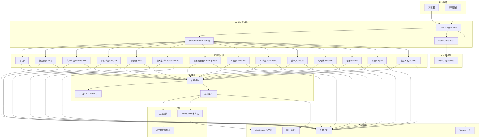
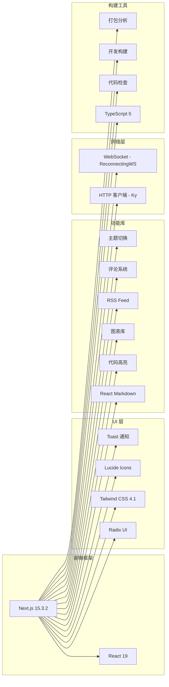
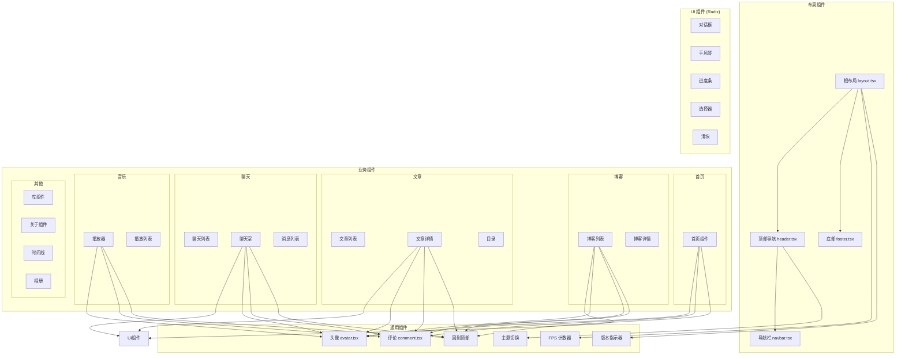
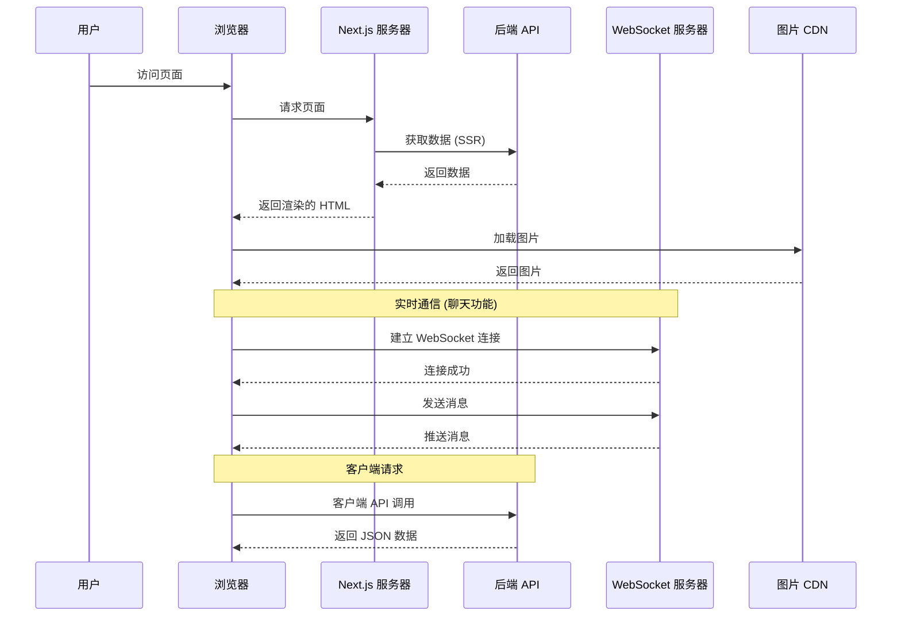
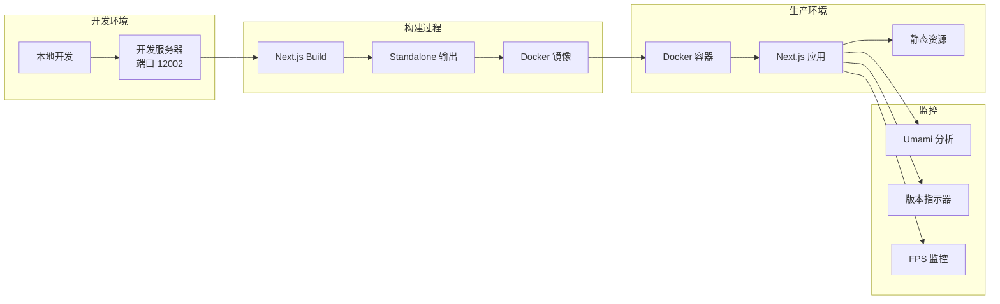

# Blog Web 项目架构图

## 整体架构



## 技术栈架构



## 组件架构



## 数据流架构



## 目录结构

```
blog-web/
├── src/
│   ├── app/                    # Next.js App Router
│   │   ├── layout.tsx         # 根布局
│   │   ├── page.tsx           # 首页
│   │   ├── about/             # 关于页
│   │   ├── album/             # 相册
│   │   ├── article/           # 文章
│   │   │   └── [uuid]/        # 动态路由
│   │   ├── blog/              # 博客
│   │   │   └── [id]/          # 动态路由
│   │   ├── chat/              # 聊天
│   │   │   └── [roomId]/      # 动态路由
│   │   ├── contact/           # 联系方式
│   │   ├── libraries/         # 库
│   │   │   └── [id]/          # 动态路由
│   │   ├── music-player/      # 音乐播放器
│   │   ├── tag/               # 标签
│   │   │   └── [id]/          # 动态路由
│   │   ├── timeline/          # 时间线
│   │   └── api/               # API 路由
│   │       └── rss/           # RSS 订阅
│   │
│   ├── components/            # React 组件
│   │   ├── ui/               # UI 基础组件 (Radix)
│   │   ├── about/            # 关于页组件
│   │   ├── album/            # 相册组件
│   │   ├── article/          # 文章组件
│   │   ├── blog/             # 博客组件
│   │   ├── chat/             # 聊天组件
│   │   ├── home/             # 首页组件
│   │   ├── libraries/        # 库组件
│   │   ├── music-player/     # 音乐播放器组件
│   │   ├── timeline/         # 时间线组件
│   │   ├── header.tsx        # 顶部导航
│   │   ├── footer.tsx        # 底部
│   │   ├── navbar.tsx        # 导航栏
│   │   ├── avatar.tsx        # 头像
│   │   ├── comment.tsx       # 评论
│   │   ├── theme-toggle.tsx  # 主题切换
│   │   ├── fps-counter.tsx   # FPS 计数器
│   │   └── versionIndicator.tsx # 版本指示器
│   │
│   ├── utils/                # 工具函数
│   │   ├── index.ts          # 通用工具
│   │   ├── websocket.ts      # WebSocket 客户端
│   │   └── get-client-info.ts # 客户端信息
│   │
│   └── types/                # TypeScript 类型定义
│       └── index.tsx
│
├── public/                   # 静态资源
├── .next/                    # Next.js 构建输出
├── next.config.ts           # Next.js 配置
├── tailwind.config.ts       # Tailwind 配置
├── tsconfig.json            # TypeScript 配置
├── package.json             # 项目依赖
├── Dockerfile               # Docker 镜像
└── deploy.sh                # 部署脚本
```

## 部署架构



## 关键特性

### 1. 服务端渲染 (SSR)
- 使用 Next.js 15 的 App Router
- 服务端数据预取
- SEO 优化

### 2. 响应式设计
- Tailwind CSS 4.1
- 移动端适配
- 设备类型检测

### 3. 实时通信
- WebSocket 支持
- 自动重连机制
- 聊天室功能

### 4. 内容管理
- Markdown 渲染
- 代码高亮
- RSS 订阅
- Giscus 评论系统

### 5. 用户体验
- 主题切换 (明暗模式)
- Toast 通知
- 进度条
- FPS 计数器
- 回到顶部

### 6. 性能优化
- 图片懒加载
- 代码分割
- Bundle 分析
- Standalone 输出模式

### 7. 开发体验
- TypeScript 支持
- ESLint 代码检查
- Turbopack 快速构建
- 热更新

### 8. 部署
- Docker 容器化
- 自动化部署脚本
- 版本号管理
- Umami 访问统计
