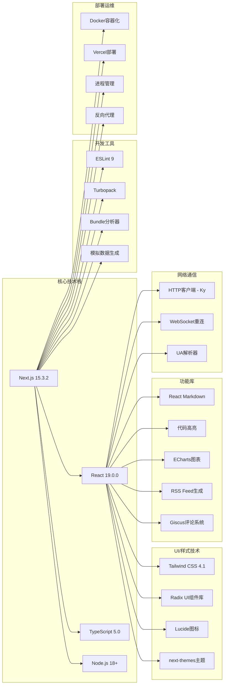
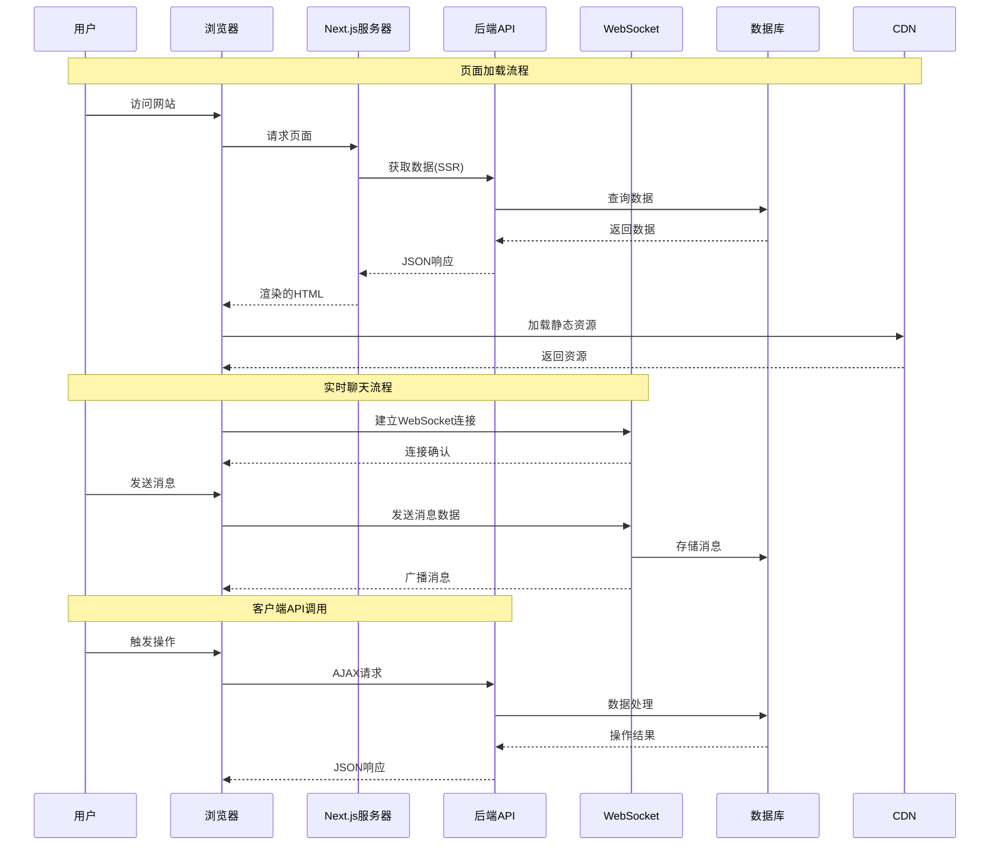

# 博客网站项目架构图与改进建议

## 🏗️ 项目架构图

### 系统整体架构

```mermaid
graph TB
    subgraph "用户层"
        U1[桌面端用户]
        U2[移动端用户]
        U3[搜索引擎爬虫]
    end

    subgraph "CDN层"
        CDN[CDN/图片服务<br/>aly.chaoyang1024.top<br/>img.chaoyang1024.top]
    end

    subgraph "Next.js应用层"
        subgraph "路由系统"
            R1[首页 /]
            R2[博客 /blog/[id]]
            R3[文章 /article/[uuid]]
            R4[聊天 /chat/[roomId]]
            R5[音乐 /music-player]
            R6[相册 /album]
            R7[时间线 /timeline]
            R8[库 /libraries/[id]]
            R9[标签 /tag/[id]]
            R10[关于 /about]
            R11[联系 /contact]
            R12[RSS /api/rss]
        end

        subgraph "渲染模式"
            SSR[服务端渲染 SSR]
            SSG[静态生成 SSG]
            CSR[客户端渲染 CSR]
        end

        subgraph "组件架构"
            LAYOUT[根布局 layout.tsx]
            HEADER[头部 header.tsx]
            FOOTER[底部 footer.tsx]
            NAVBAR[导航 navbar.tsx]
            
            subgraph "业务组件"
                HOME[首页组件组]
                BLOG[博客组件组]
                ARTICLE[文章组件组]
                CHAT[聊天组件组]
                MUSIC[音乐组件组]
                ALBUM[相册组件组]
            end
            
            subgraph "UI组件库"
                RADIX[Radix UI基础组件]
                CUSTOM[自定义UI组件]
            end
        end
    end

    subgraph "服务层"
        API[后端API服务<br/>api.sunrise1024.top:12345]
        WS[WebSocket服务<br/>WebSocket服务器]
        ANALYTICS[Umami分析服务<br/>umami.sunrise1024.top]
    end

    subgraph "数据层"
        DB[(数据库)]
        CACHE[(缓存)]
        STORAGE[(文件存储)]
    end

    U1 & U2 & U3 --> CDN
    U1 & U2 & U3 --> R1 & R2 & R3 & R4 & R5 & R6 & R7 & R8 & R9 & R10 & R11 & R12
    
    R1 & R2 & R3 & R10 --> SSR
    R4 & R5 & R6 & R7 & R8 & R9 & R11 --> CSR
    R12 --> SSG
    
    SSR & CSR --> LAYOUT
    LAYOUT --> HEADER & FOOTER & NAVBAR
    HEADER & FOOTER & NAVBAR --> HOME & BLOG & ARTICLE & CHAT & MUSIC & ALBUM
    HOME & BLOG & ARTICLE & CHAT & MUSIC & ALBUM --> RADIX & CUSTOM
    
    CHAT --> WS
    HOME & BLOG & ARTICLE --> API
    ANALYTICS --> API
    API --> DB & CACHE & STORAGE
```

### 技术栈架构图



### 数据流架构图



## 🔍 项目现状分析

### ✅ 项目优势

1. **现代化技术栈**
   - 使用最新的 Next.js 15.3.2 和 React 19.0.0
   - TypeScript 提供完整的类型安全
   - Tailwind CSS 4.1 现代化样式框架

2. **良好的项目结构**
   - 清晰的目录组织（app router、components、utils、types）
   - 模块化组件设计
   - 统一的类型定义

3. **丰富的功能特性**
   - 博客系统、实时聊天、音乐播放器、相册展示
   - RSS订阅、评论系统、主题切换
   - 响应式设计，移动端适配

4. **性能优化**
   - SSR/SSG 混合渲染策略
   - 图片懒加载和CDN优化
   - Bundle分析和代码分割

### ⚠️ 需要改进的地方

#### 1. 🚨 安全问题

**高风险问题：**
- `next.config.ts` 中禁用了 ESLint 和 TypeScript 检查
- WebSocket 连接使用硬编码的端口号和协议
- 用户ID生成使用简单的随机数，存在重复风险
- 缺少输入验证和XSS防护

**建议修复：**
```typescript
// 重新启用代码检查
eslint: {
  ignoreDuringBuilds: false, // 改为 false
},
typescript: {
  ignoreBuildErrors: false, // 改为 false
},

// 加强WebSocket安全配置
const wsUrl = new URL(`/ws/${roomName}/${userId}`, process.env.NEXT_PUBLIC_WS_URL);
wsUrl.protocol = window.location.protocol === 'https:' ? 'wss:' : 'ws:';

// 使用更安全的用户ID生成
const generateUserId = () => {
  const timestamp = Date.now().toString(36);
  const random = Math.random().toString(36).substr(2, 9);
  return `user_${timestamp}_${random}`;
};
```

#### 2. 🐛 代码质量问题

**主要问题：**
- 重复的代码逻辑（如消息处理）
- 缺少错误边界处理
- 硬编码的常量值
- 不一致的命名规范

**改进建议：**
```typescript
// 创建统一的错误处理hook
export function useErrorHandler() {
  const handleError = (error: Error, errorInfo?: ErrorInfo) => {
    console.error('Application error:', error, errorInfo);
    // 发送错误到监控服务
  };
  return { handleError };
}

// 提取常量配置
export const CONFIG = {
  API_BASE_URL: process.env.NEXT_PUBLIC_API_URL,
  WS_URL: process.env.NEXT_PUBLIC_WS_URL,
  DEFAULT_PAGE_SIZE: 12,
  MESSAGE_RETENTION_HOURS: 24,
  MAX_FILE_SIZE: 10 * 1024 * 1024, // 10MB
} as const;
```

#### 3. ⚡ 性能优化机会

**优化点：**
- 实现虚拟滚动处理长列表
- 添加图片压缩和WebP格式支持
- 实现Service Worker缓存策略
- 优化首屏加载时间

```typescript
// 虚拟滚动实现
export function useVirtualScroll(items: any[], itemHeight: number) {
  const [visibleRange, setVisibleRange] = useState({ start: 0, end: 20 });
  const containerRef = useRef<HTMLDivElement>(null);
  
  useEffect(() => {
    const handleScroll = () => {
      const scrollTop = containerRef.current?.scrollTop || 0;
      const start = Math.floor(scrollTop / itemHeight);
      const end = start + Math.ceil(window.innerHeight / itemHeight) + 1;
      setVisibleRange({ start, end });
    };
    
    containerRef.current?.addEventListener('scroll', handleScroll);
    return () => containerRef.current?.removeEventListener('scroll', handleScroll);
  }, []);
  
  return { containerRef, visibleItems: items.slice(visibleRange.start, visibleRange.end) };
}
```

#### 4. 📱 用户体验改进

**改进方向：**
- 添加加载骨架屏
- 实现渐进式Web应用(PWA)
- 优化移动端触摸体验
- 添加离线支持

```typescript
// PWA配置
export const pwaConfig = {
  register: true,
  skipWaiting: true,
  runtimeCaching: [
    {
      urlPattern: /^https:\/\/api\.sunrise1024\.top/,
      handler: 'NetworkFirst',
      options: {
        cacheName: 'api-cache',
        expiration: {
          maxEntries: 100,
          maxAgeSeconds: 60 * 60 * 24, // 24小时
        },
      },
    },
  ],
};
```

#### 5. 🔧 开发体验优化

**建议：**
- 添加自动化测试（单元测试、集成测试、E2E测试）
- 实现CI/CD流水线
- 添加代码提交规范检查
- 完善错误监控和日志系统

```typescript
// 测试配置示例
// jest.config.js
module.exports = {
  testEnvironment: 'jsdom',
  setupFilesAfterEnv: ['<rootDir>/jest.setup.js'],
  moduleNameMapping: {
    '^@/(.*)$': '<rootDir>/src/$1',
  },
  testMatch: [
    '**/__tests__/**/*.(ts|tsx)',
    '**/*.(test|spec).(ts|tsx)',
  ],
  collectCoverageFrom: [
    'src/**/*.{ts,tsx}',
    '!src/**/*.d.ts',
  ],
};
```

## 🎯 改进优先级建议

### 🔥 高优先级（立即修复）
1. **安全漏洞修复**
   - 重新启用ESLint和TypeScript检查
   - 加强WebSocket安全配置
   - 实现输入验证和XSS防护

2. **错误处理完善**
   - 添加全局错误边界
   - 实现API错误重试机制
   - 添加用户友好的错误提示

### ⚡ 中优先级（近期完成）
1. **性能优化**
   - 实现虚拟滚动
   - 优化图片加载
   - 添加缓存策略

2. **代码质量提升**
   - 重构重复代码
   - 统一命名规范
   - 添加TypeScript严格模式

### 📈 低优先级（长期规划）
1. **功能增强**
   - 实现PWA功能
   - 添加离线支持
   - 优化移动端体验

2. **开发体验**
   - 添加自动化测试
   - 实现CI/CD
   - 完善监控体系

## 📊 技术债务评估

| 类别 | 严重程度 | 数量 | 影响范围 | 修复成本 |
|------|----------|------|----------|----------|
| 安全问题 | 🔴 高 | 5 | 全站 | 中等 |
| 性能问题 | 🟡 中 | 8 | 部分页面 | 低 |
| 代码质量 | 🟡 中 | 12 | 组件级别 | 低 |
| 用户体验 | 🟢 低 | 6 | 交互层面 | 中等 |
| 开发体验 | 🟢 低 | 4 | 开发流程 | 高 |

## 🚀 实施建议

1. **分阶段实施**：按照优先级分批次修复问题
2. **测试驱动**：为关键功能编写测试用例
3. **渐进式重构**：避免大规模重构，采用渐进式改进
4. **监控反馈**：建立完善的监控和反馈机制
5. **团队协作**：制定代码规范和最佳实践

这个架构图和改进建议将帮助您更好地理解项目现状，并制定合理的优化计划。